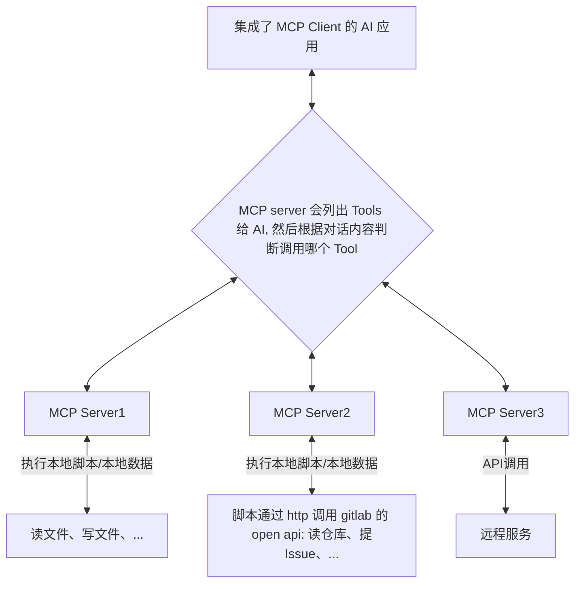

[Model Context Protocol](https://modelcontextprotocol.io/) 简称 MCP，是一种大模型上下文协议，旨在标准化应用程序向大型语言模型（LLMs）提供上下文信息的方式。

**为什么需要 MCP？**

当前 AI 应用（Agent）开发面临一个共同难题：在调用用户本地的文件、数据库、代码仓库时，需要针对不同的框架写不同的代码，很难互相兼容。MCP 致力于为 AI 应用提供一个**通用的、标准化的接口，以便安全、高效地访问和利用分布在用户本地或私有环境中的各类数据与功能**。 你可以将 MCP **类比为数据传输领域的 USB-C 接口**。就像 USB-C 统一了各种设备的连接和充电标准一样。

这使得 LLMs 不再仅仅依赖于训练数据或公开网络信息，更能理解和操作用户的实时、私有上下文。这种"即插即用"的特性让 AI 真正融入工作场景：无需上传数据到云端，就能直接分析你本地的项目文档；不必开放系统权限，就能安全调用企业内部的数据库。

## 了解交互流程



上图解释了 MCP 的交互方式交互方式：

- **MCP Host：** 例如 Claude Desktop、Cursor IDE 或其他集成了 MCP Client 的 AI 应用。
- **MCP Client：** 遵循 MCP 协议的客户端库，负责与 MCP 服务器建立和维护连接。
- **MCP Server：** 每个服务器专注于暴露特定的数据源或功能（如文件系统访问、数据库查询）。它接收来自 MCP Client 的请求，执行相应操作，并返回结果。
- **本地数据/本地操作：** MCP 服务器能够安全访问的本地资源，如计算机上的文件、本地数据库、应用程序状态等。
- **API 调用：** 可通过互联网（例如通过API）访问的外部系统，MCP Server可与之连接。

 **交互流程：** 主机应用（如 Claude）通过其内置的 MCP 客户端，发现并连接到本地运行的 MCP 服务器。当用户与 AI 对话时，主机可以将请求（例如“总结这个文档”或“查询数据库”）发送给相应的 MCP 服务器。服务器执行操作（读取文件、查询数据库）后，将结果或上下文信息返回给主机，主机再将其整合到本次对话的上下文中。

## 使用前环境

通常 MCP Server 使用 js 或者 python 开发实现，你的电脑需要有 node、python 相关的环境。

- 比如 npx 你需要安装 [node](https://nodejs.org/en/)

  PS: 我还推荐你安装 [bun](https://bun.sh/)，使用 `bunx` 命令代替 `npm -y` 命令，速度更加快。

- 比如 python 你可以安装 [uv](https://docs.astral.sh/uv/)

你也可以使用其他的，本质上就是执行特定语言的包的脚本。

## 使用示例：解锁本地能力

以下是一些官方和社区提供的 MCP 服务器示例，展示了如何通过 MCP 让 AI 与你的本地环境互动：

### [文件系统 MCP Server](https://github.com/modelcontextprotocol/servers/tree/main/src/filesystem)

此服务器允许 AI 访问和操作你指定的文件目录。

**配置示例**：

```json
{
  "mcpServers": {
    "filesystem": {
      "command": "npx",
      "args": [
        "-y",
        "@modelcontextprotocol/server-filesystem",
        // 重要：指定 MCP 可访问的根目录，确保安全
        "/Users/[username]/anypath"
      ]
    }
  }
}
```

**注意：** 务必配置 `args` 中的路径为你希望授权 AI 访问的特定目录，避免潜在的误操作风险。

 **应用场景：**

- 让 AI **分析、总结或重命名**指定目录下的文件。
- 基于本地文档内容进行**问答或内容创作**。
- 要求 AI **整理或分类**目录中的文件。

### [SQLite MCP Server](https://github.com/modelcontextprotocol/servers/tree/main/src/sqlite)

使 AI 能够直接与本地 SQLite 数据库进行交互。

**配置示例：**

```json
{
  "mcpServers": {
    "sqlite": {
      "command": "uv",
      "args": [
        "--directory",
        "parent_of_servers_repo/servers/src/sqlite",
        "run",
        "mcp-server-sqlite",
        "--db-path",
        "~/test.db"
      ]
    }
  }
}
```

**环境提示：** 你需要把  sqlite mcp server  下载到本地，示例中 `parent_of_servers_repo/servers/src/sqlite` 就表示是它的目录。

**应用场景：**

- 让 AI **直接操作数据库**：创建表结构、插入数据、执行 SQL 查询。
- **自然语言交互**：用日常语言让 AI 帮你记录消费（插入数据）、查询开销（执行查询）等。
- 基于数据库内容进行**数据分析和报告生成**。

### [Gitlab MCP Server](https://github.com/modelcontextprotocol/servers/tree/main/src/gitlab)

将你的 GitLab (包括自部署实例) 集成到 AI 的上下文中。

```json
{
  "mcpServers": {
    "gitlab": {
      "command": "npx",
      "args": [
        "-y",
        "@modelcontextprotocol/server-gitlab"
      ],
      "env": {
        "GITLAB_PERSONAL_ACCESS_TOKEN": "<YOUR_TOKEN>",
        "GITLAB_API_URL": "https://git.olymtech.com/api/v4"
      }
    }
  }
}
```

**已知问题与解决方案：**

- **官方服务器对自部署 GitLab 的兼容性问题：** 当前官方服务器可能对某些自部署 GitLab 实例支持不完善（参见 [相关 PR](https://github.com/modelcontextprotocol/servers/pull/721)）。
- **社区增强版服务器：** 我开发了一个[增强版的 GitLab MCP Server](https://github.com/simonwong/mcp-servers/tree/main/src/gitlab)，它**兼容自部署的 GitLab**，并且**增加了查询仓库代码树**的功能。 **使用增强版服务器的配置：**

```json
{
  "mcpServers": {
    "gitlab": {
      "command": "npx",
      "args": [
        "-y",
        "@simonwong/mcp-gitlab-server"
      ],
      "env": {
        "GITLAB_PERSONAL_ACCESS_TOKEN": "<YOUR_TOKEN>",
        "GITLAB_API_URL": "https://git.olymtech.com/api/v4"
      }
    }
  }
}
```

**应用场景：**

- 让 AI **查询项目信息、Issue、Merge Request**。
- （使用增强版）让 AI **浏览代码仓库结构**，或获取特定文件的内容。
- 结合代码和 Issue 信息，辅助**代码审查或问题分析**。

## MCP 客户端配置

要让支持 MCP 的应用程序（主机）能够使用你配置的 MCP 服务器，需要进行简单的配置。

PS：正因为是通用的协议，你可以将配置复制到任何支持 MCP 的配置文件中。

### Claude Desktop

- 找到并编辑配置文件：`~/Library/Application Support/Claude/claude_desktop_config.json` (macOS 路径示例)
- 在该 JSON 文件中添加或修改 `mcpServers` 部分，如上面的示例所示。

### Cursor

- 确保你的 Cursor 版本支持 MCP（较新版本通常都支持）。
- **全局配置：** 修改 `~/.cursor/mcp.json` 文件，这里的配置对所有项目生效。
- **项目级配置：** 在你的项目根目录下创建 `.cursor/mcp.json` 文件，这里的配置仅对该项目生效，并会覆盖全局配置中的同名服务器。

**提示：** 在 Cursor 中，MCP 功能通常只在 **Agent 模式**下激活。另外默认情况下，每次需要使用 MCP 提供的工具（Tool）时，可能需要**手动点击 "Run Tool"** 来授权执行。

## 开发 MCP 服务

如果你需要连接到 MCP 尚不支持的数据源（如特定数据库、内部 API、特殊硬件）或实现自定义功能，可以开发自己的 MCP 服务器。 官方概念文档：[MCP Architecture Concepts](https://modelcontextprotocol.io/docs/concepts/architecture) 。

MCP 服务器主要通过实现以下几种能力来与主机和 LLM 交互：

- **Resources (资源)**：将你的数据或内容暴露给 LLM。资源通过唯一的 URI 标识。
  - **作用：** 让 LLM 能够“读取”你的数据。
  - 示例：
    - 本地文件: `file:///Users/me/Documents/report.pdf`
    - 数据库记录: `postgres://mydb/customers/id/123`
    - API 端点响应: `api://myapi/users?active=true`
    - 屏幕截图: `screen://localhost/display1`
    - 其他任何可以通过 URI 表示的数据。
- **Prompts (提示模板)**：创建可复用的、结构化的提示或工作流模板。
  - **作用：** 封装常用的 LLM 交互模式，可以包含动态参数和来自 `Resources` 的上下文。
  - **示例：** 一个 "Summarize Document" 的 Prompt，可以接受一个文件 `Resource` URI 作为参数，自动生成包含该文件内容的总结请求。
- **Tools (工具)**：允许 LLMs 通过你的服务器执行具体操作。
  - **作用：** 让 LLMs 能够“行动”，而不仅仅是读取信息。
  - **流程：** 主机通过 `tools/list` 发现可用工具，然后通过 `tools/call` 调用特定工具并传递参数，服务器执行操作后返回结果。
  - **示例：** 发送邮件、创建日历事件、执行 Git 命令、调用内部 API 的 POST 请求等。

### 通过 AI 进行开发

你可以借助 LLM 来加速 MCP 服务器的开发过程：

1. **提供核心上下文：** 将 MCP 官方文档的关键信息（尤其是 [LLMs Full Context](https://modelcontextprotocol.io/llms-full.txt)）和 SDK 文档提供给 LLM。
2. **提供 SDK 信息：** 指向 [MCP TypeScript SDK](https://github.com/modelcontextprotocol/typescript-sdk) 或 [Python SDK](https://github.com/modelcontextprotocol/python-sdk) 的代码仓库或文档。
3. **清晰描述需求：** 明确你想要构建的服务类型、需要连接的数据源、希望暴露的 Resources、Prompts 和 Tools。

**示例提示:**

```
我想基于 MCP Python SDK 构建一个 MCP 服务器，它需要：
1. 连接到我公司的 PostgreSQL 数据库 (提供连接信息占位符)。
2. 将数据库中的表结构作为 Resources 暴露出来 (例如 `postgres://mydb/public/users/schema`)。
3. 提供一个 Tool，允许执行只读的 SQL 查询，并将结果返回。Tool 名称为 `executeQuery`，接收 SQL 语句作为参数。
4. 提供一个 Prompt，用于生成常见的月度销售报告查询 SQL。Prompt 名称为 `generateMonthlySalesReportSQL`，接收月份参数。
请帮我生成基本的服务器代码结构和关键函数的实现思路。
```

### 本地调试

开发过程中，调试是必不可少的环节：

- MCP Inspector：官方提供的可视化调试工具。它可以模拟 MCP 主机，向你的本地服务器发送请求并展示交互过程。

  - 运行命令：`npx @modelcontextprotocol/inspector <command>` (command 通常是 `serve` 或指向你的服务器启动命令)

  

- 本地 Node.js 工程调试

  1. 启动你的本地 Node.js MCP 服务器（例如 `node your-server-entrypoint.js`）。
  2. 运行 MCP Inspector，并将其配置为连接到你本地服务器的地址和端口（通常 Inspector 会自动发现或允许你指定）。
  3. 使用 Inspector 的界面来发送 `resource/get`, `tools/list`, `tools/call` 等请求，观察你的服务器日志和 Inspector 中的响应。

## 资源汇总

### MCP 服务器与社区

- [MCP Servers Repository](https://github.com/modelcontextprotocol/servers) - 官方仓库，包含参考实现和社区提交的服务器。
- [Awesome MCP Servers](https://github.com/punkpeye/awesome-mcp-servers) - 精选的 MCP 服务器列表，方便发现高质量实现
- [Smithery](https://smithery.ai/) MCP server 聚合站
- [pulse](https://www.pulsemcp.com/) MCP server 聚合站
- [mcp so](https://mcp.so/) MCP server 聚合站

### 工具

- [MCP Inspector](https://www.npmjs.com/package/@modelcontextprotocol/inspector): (官方工具) 上文提到的可视化调试工具，通过 `npx @modelcontextprotocol/inspector` 使用。

- [MCP CLI](https://github.com/wong2/mcp-cli): (社区工具) 用于从命令行测试和检查 MCP 服务器的工具。

- [MCP Get](https://mcp-get.com/): (社区工具) 用于简化 MCP 服务器安装和管理的工具。

## 结语

MCP 为打通 AI 与用户本地或远程数据之间的壁垒提供了一个富有前景的标准化方案，处理上述的 MCP server，还有很多非常实用的，以后再分享推荐。
